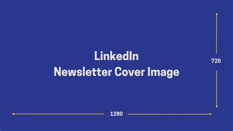

## Intro

Short intro paragraph. Use to preview hero, metadata, TOC, social cards, and content rendering.

## Section: Images



Caption: Hero image preview.

## Section: Code

```html
<!-- small snippet to exercise code styling -->
<article class="post">Hello</article>
```

## Section: Lists

- Bullet item one
- Bullet item two
  - Nested item

## Section: Blockquote

> Example blockquote to check typography and spacing.

## Conclusion

End of rich article test. Validate: cover, meta tags, og image, toc, code styling, lists, blockquote.
